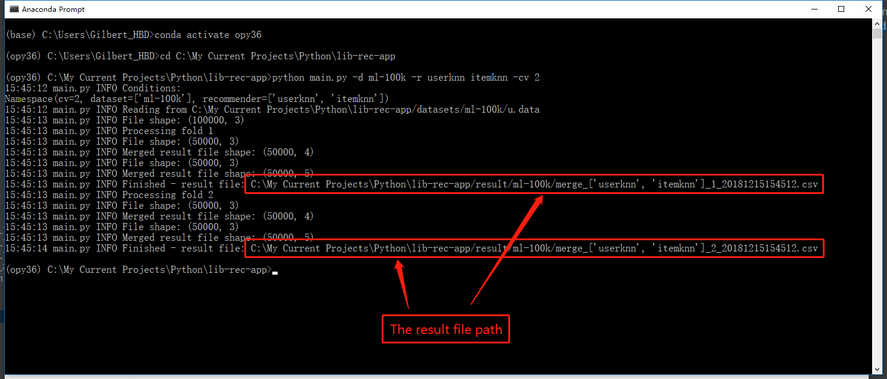

# README

## Introduction - LibRecApp.jar 

//TODO: 

## Introduction - main.py

1. Open `Anaconda3 `-->`Anaconda Prompt`

   

2. Execute the command:

   ```bash
   conda activate py36
   ```

   The cli (Command Line Interface) would show:

   

3. Use `cd` command to `ch`ange the current working `dir`ectory to the folder of `main.py`

   ```bash
   cd C:\Users\hongl\OneDrive\Documents\LibRecApp
   ```

   The cli would show:

   

4. Execute the `Python` script to generate the merged files:

   ```bash
   python main.py -d [your dataset(s)] -r [your recommender(s)] -cv [the number of cross validation]
   ```

   *Example*:

   **Experiment Condition:**

   1. Dataset: `ml-1m`
   2. Recommender: `userknn`、`itemknn`
   3. CV: `5`

   ```bash
   python main.py -d ml-1m -r userknn itemknn -cv 5
   ```

   The cli would show:

   

   *Note:*

   To get simple prompt usage:

   ```bash
   python main.py -h
   ```

   The cli would show:

   

5. Output file name:

   ```bash
   .../result/<dataset>/merge_[<recommender name>]_<cv>_<timestamp>.csv
   ```

   Like:

   
