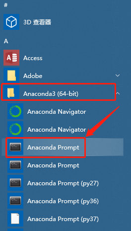

# README

## Introduction - lib-rec-app.jar 

This program  is customized by **Command Line (cli)** and **Configuration files**.

### Command Line

The following command line parameters are available:

`[-cv <arg>] [-d <arg>] [-r <arg>] [-s]`

More precisely,

1. `-h` : print help information.
2. `-cv` : The number of folds for cross validation, default: 5.
3. `-d` or `--dataset`:   The dataset(s) to be processed, valid options are based on configuration file "*default.properties*".
4. `-r` or `--recommender` : The recommender(s) to be applied, valid options are based on configuration file "*default.properties*".
5. `-s` or `--split` : Whether to **re**-split the dataset, default: false.

For example, if you'd like to test `user-based kNN` and `item-based kNN` algorithms on datasets `ml-100k` and `ml-1m`, the folds of Cross Validation is 6, the command would be:

``` bash
java -jar lib-rec-app.jar -d ml-100k ml-1m -r userknn itemknn -cv 6
```

\* ***NB***: The abbreviations of algorithms are based on [Librec](https://www.librec.net/) project, available at: [AlgorithmList](https://www.librec.net/dokuwiki/doku.php?id=AlgorithmList#recommender_algorithm_list).

### Configuration Files

The detailed configurations of this program and specific parameters of each algorithms are determined by various configuration files:

1. The default configuration
   1. Specify the default settings such as the data directories, dataset path.
   2. For more details, please refer to [default.properties](conf/default.properties).
2. The dataset information
   1. Specify the input path, data format, etc.
   2. For more details, please refer to [Dataset folder](conf/dataset).
   3. **NB**: Will override same settings of [default.properties](conf/default.properties).
3. The Recommender algorithms parameters
   1. Specify parameters of each algorithms.
   2. For more details, please refer to [Algorithms folder](conf/recommender).
   3. **NB**: Will override same settings of files in [Dataset folder](conf/dataset).
   4. Some parameter templates are available at: [Algorithms Configuration](https://www.librec.net/dokuwiki/doku.php?id=AlgorithmList#algorithm_configuration_list).


## Introduction - main.py

1. Open `Anaconda3 `-->`Anaconda Prompt`

   

2. Execute the command:

   ```bash
   conda activate py36
   ```

   The cli (Command Line Interface) would show:

   

3. Use `cd` command to `ch`ange the current working `dir`ectory to the folder of `main.py`

   ```bash
   cd C:\Users\hongl\OneDrive\Documents\LibRecApp
   ```

   The cli would show:

   

4. Execute the `Python` script to generate the merged files:

   ```bash
   python main.py -d [your dataset(s)] -r [your recommender(s)] -cv [the number of cross validation]
   ```

   *Example*:

   **Experiment Condition:**

   1. Dataset: `ml-1m`
   2. Recommender: `userknn`、`itemknn`
   3. CV: `5`

   ```bash
   python main.py -d ml-1m -r userknn itemknn -cv 5
   ```

   The cli would show:

   

   *Note:*

   To get simple prompt usage:

   ```bash
   python main.py -h
   ```

   The cli would show:

   

5. Output file name:

   ```bash
   .../result/<dataset>/merge_[<recommender name>]/cv_<cv>_<timestamp>.csv
   ```

   


## Some Tips of UNIX commands

A very useful simple-doc for UNIX introduction is available at: [UNIX Survival Guide](http://titan.csit.rmit.edu.au/~e70949/inductionguide.pdf). (The cheat sheet at Page 30)

Please read carefully from Page 10 to Page 16. (Very easy to understand, I promise :)

### "Screen" Command

Some times you may want to do something else and leave the server running at background. The `screen` command would be very useful.

Here is a simple introduction of [screen](http://aperiodic.net/screen/quick_reference).

You may use:

```bash
screen -ls
```

To list all sessions (attached and detached).

Example:


```bash
screen -r <Session name> (for example: screen -r 47647)
```

To resume (move to) certain screen. For convenience, you can type `screen -r 4` as only one session name starts with "4". If you want to resume session "31185", you can type `screen -r 311` at least, as there is another session named "**31**069".


`Ctrl`-`A` + `Ctrl`-`D`

To detach the current and return to parent session.

Example:


```bash
exit
```

Close current session, can be used on main session and any sub sessions.